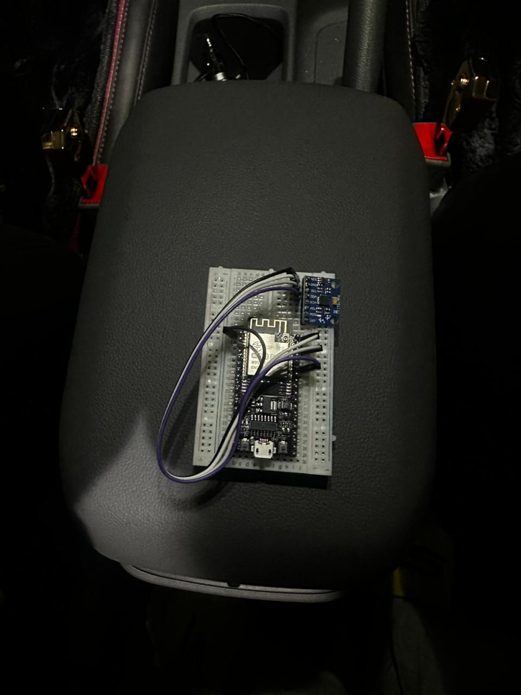

# 🚗 IoT Based Gesture Controlled Car using ESP32

> Control a robotic car with hand gestures — no buttons, no app. Just tilt your hand.


---

## 📌 Overview

This project implements a **wireless gesture-controlled robotic car** using two ESP32 boards communicating over the **ESP-NOW** protocol. The transmitter reads tilt data from an **MPU6050** gyroscope strapped to your hand, and the receiver drives **DC motors** via an **L298N** motor driver — in real time, with no Wi-Fi router needed.

```
[Hand Gesture]
     │
  MPU6050 (I²C)
     │
  TX ESP32  ──── ESP-NOW (2.4GHz) ────►  RX ESP32
                                               │
                                           L298N Driver
                                               │
                                      [Left Motor] [Right Motor]
```

---
## 📷 Project Preview

### 🔧 Hardware Setup


### 🎮 Transmitter Unit



## 🧰 Components

| Component | Quantity | Purpose |
|---|---|---|
| ESP32 Dev Board | 2 | Transmitter + Receiver |
| MPU6050 Gyroscope | 1 | Gesture / tilt detection |
| L298N Motor Driver | 1 | Motor speed & direction |
| Robot Chassis + DC Motors | 1 set | Physical car body |
| Battery Pack | 1 | External power for motors |
| Jumper Wires | — | Connections |

---

## 🔌 Wiring

### Transmitter — MPU6050 → ESP32

| MPU6050 Pin | ESP32 Pin |
|---|---|
| VCC | 3.3V |
| GND | GND |
| SDA | GPIO 21 |
| SCL | GPIO 22 |

### Receiver — L298N → ESP32

| L298N Pin | ESP32 Pin |
|---|---|
| ENA | GPIO 25 |
| IN1 | GPIO 26 |
| IN2 | GPIO 27 |
| IN3 | GPIO 12 |
| IN4 | GPIO 14 |
| ENB | GPIO 13 |
| VIN | External Battery (+) |
| GND | Common Ground |

> ⚠️ **Power Note:** Always use a separate external battery for the L298N motor supply. Do NOT power motors from the ESP32's 3.3V or 5V rail.

---

## 📡 Communication — ESP-NOW

ESP-NOW is a connectionless Wi-Fi protocol by Espressif. It allows direct peer-to-peer communication between ESP32 boards without a router.

- **Range:** ~200m line-of-sight
- **Latency:** < 5ms
- **Data size:** Up to 250 bytes per packet
- **No Wi-Fi router required**

The transmitter sends gesture data (tilt angles from MPU6050) to the receiver's MAC address. The receiver parses the packet in a callback and drives the motors accordingly.

---

## 🚀 Getting Started

### Prerequisites

- [Arduino IDE](https://www.arduino.cc/en/software) with ESP32 board support
- Libraries:
  - `esp_now.h` (built-in with ESP32 core)
  - `WiFi.h` (built-in)
  - `Adafruit MPU6050` — install via Library Manager
  - `Adafruit Unified Sensor`

### Setup Steps

1. **Clone the repository**
   ```bash
   git clone https://github.com/your-username/iot-based-gesture-controlled-car.git
   cd iot-based-gesture-controlled-car
   ```

2. **Find your Receiver's MAC address**  
   Upload `get_mac_address.ino` to the receiver ESP32 and note the output from Serial Monitor.

3. **Update the MAC address in transmitter code**
   ```cpp
   uint8_t receiverMAC[] = {0xXX, 0xXX, 0xXX, 0xXX, 0xXX, 0xXX};
   ```

4. **Upload `transmitter.ino`** to the hand-held ESP32 (with MPU6050)

5. **Upload `receiver.ino`** to the ESP32 on the car (with L298N)

6. **Power up, tilt your hand, and drive!**

---

## 🎮 Gesture Controls

| Gesture | Direction |
|---|---|
| Tilt Forward | Move Forward |
| Tilt Backward | Move Backward |
| Tilt Left | Turn Left |
| Tilt Right | Turn Right |
| Level / Flat | Stop |

---

## 🐛 Debugging Log

Key issues encountered and resolved during development:

- ✅ Fixed reverse/right motor direction issue
- ✅ Corrected ENA/ENB GPIO configuration
- ✅ Verified ESP32 receiver MAC address binding
- ✅ Fixed ESP-NOW callback signature for ESP32 Arduino core v3.x
- ✅ Resolved receiver boot loop and upload issues
- ✅ Verified successful end-to-end ESP-NOW communication

---

## 🔮 Future Improvements

- [ ] **PWM Speed Control** — Variable motor speed based on tilt angle magnitude
- [ ] **AI Gesture Recognition** — Train a TinyML model on the ESP32 for custom gestures
- [ ] **Mobile App Integration** — Bluetooth/Wi-Fi app as an alternative controller
- [ ] **OLED Display** — Show tilt angles and connection status on transmitter
- [ ] **Obstacle Avoidance** — Add HC-SR04 ultrasonic sensor on the car

---

## 📁 Project Structure

```
iot-based-gesture-controlled-car/
├── transmitter/
│   └── transmitter.ino       # MPU6050 + ESP-NOW sender
├── receiver/
│   └── receiver.ino          # ESP-NOW receiver + L298N motor control
├── utils/
│   └── get_mac_address.ino   # Helper to print ESP32 MAC address
└── README.md
```

---

## 📜 License

MIT License — feel free to use, modify, and build on this project.

---

## 🙌 Acknowledgements

- [Espressif ESP-NOW Documentation](https://docs.espressif.com/projects/esp-idf/en/latest/esp32/api-reference/network/esp_now.html)
- [Adafruit MPU6050 Library](https://github.com/adafruit/Adafruit_MPU6050)
- Built with ❤️ using Arduino IDE + ESP32 ecosystem
